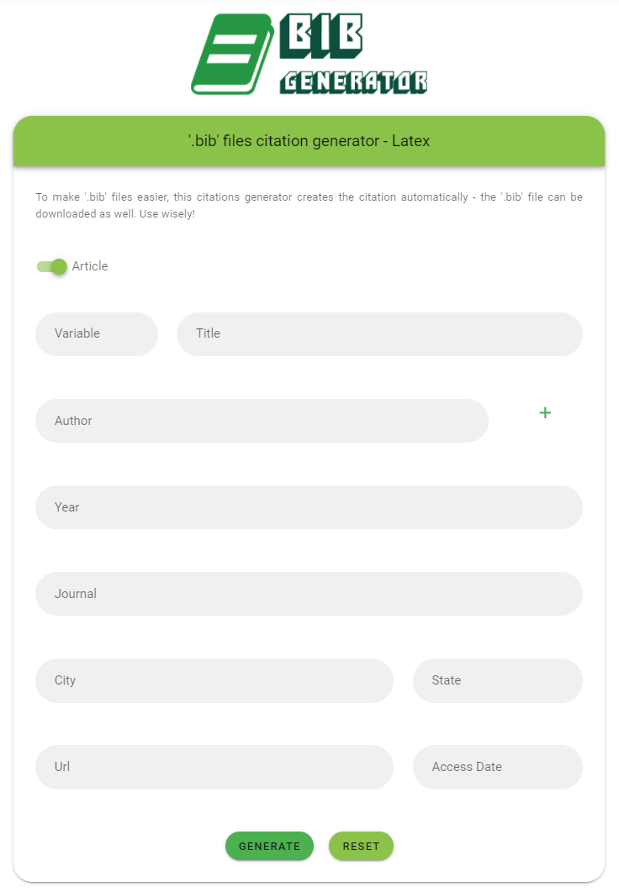
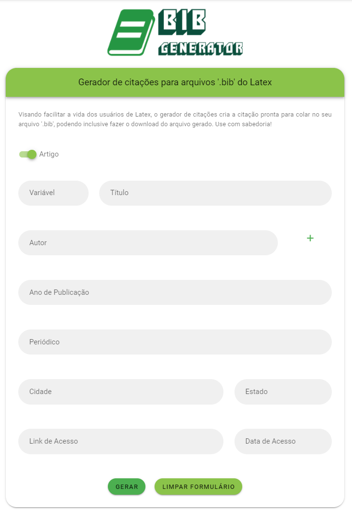
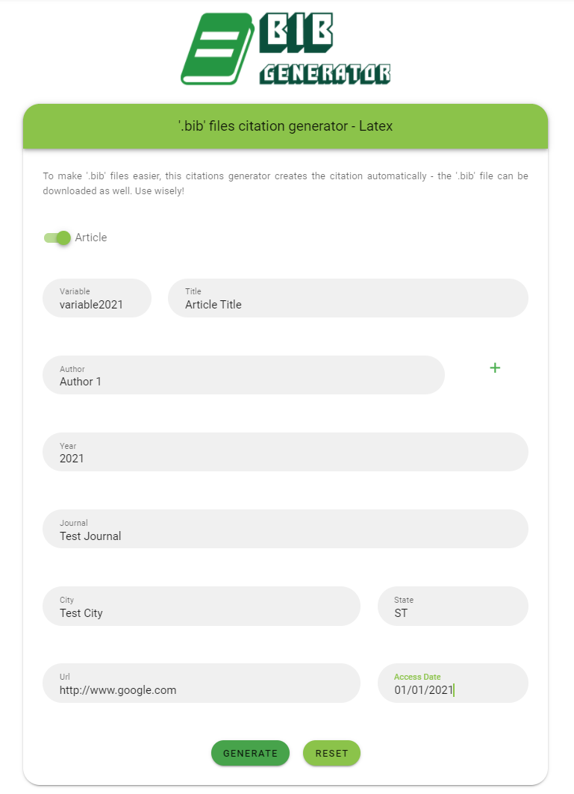
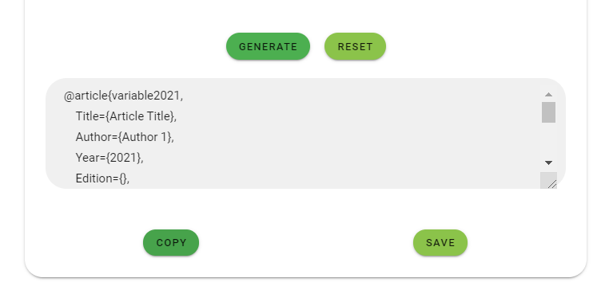

# 📗 Gerador de Citações '.bib'

<p align=”justify” style="text-align: justify;">
Já pensou em quanto tempo gasto criando as variáveis de citação do latex, usando compiladores em sua máquina ou o próprio <a href="https://www.overleaf.com/">Overleaf</a>? Pode parecer pouca coisa, mas já que temos a programação ao nosso lado para automatizar tarefas e facilitar a vida das pessoas, por que não criar um gerador de citações em que o usuário entra com os valores e a citação já sai prontinha? Podendo inclusive salvar o arquivo. Este é o objetivo deste projeto.
</p>

<br/>

#### ✂️ Funcionalidades:
- Plataforma em dois idiomas.
- Geração de citações para livros e artigos.
- Utilização de até 6 autores.
- Download de arquivo com extensão 'bib'.
- Redirecionamento para GitHub do desenvolvedor.
- Email para o desenvolvedor.

<br/>

<br/>

#### ↖️ Melhorias (Versão 2.0):
- Componentização (atual é single component).
- Melhoria na atualização dinâmica de autores.
- Login e Histórico de citações criadas.
- Geração de arquivo com mais de uma citação.

#### 🛠️ Instalação do Projeto

- Clonar o repositório, rodando o comando a seguir dentro da pasta criada:

```
yarn install
npm i
```

<br/>

#### 🔗 Link - Firebase
- https://quote-generator-bib.web.app/

<br/>

#### 🖥️ Interface e exemplos

Para o desenvolvimento deste projeto, um arquivo de configuração '.json' foi utilizado, contendo todos os aspectos visuais da interface, além de contar com a opção de tradução da plataforma para o inglês. As imagens a seguir mostram a interface principal (contendo o formulário e os atributos da citação a ser gerada).

<br/>

##### 📰 Geração de Citações para Artigos (Exemplo - Ingês/Português)

</img>
</img>

<br/>


##### 📖 Geração de Citações para Livros (Exemplo - Ingês/Português)

</img>
</img>

<br/>

##### 📖 Geração de Citações (Exemplo)

</img>

<br/>

##### 📖 Geração de Citações - Download de Arquivo (Exemplo)

</img>

<br/>
